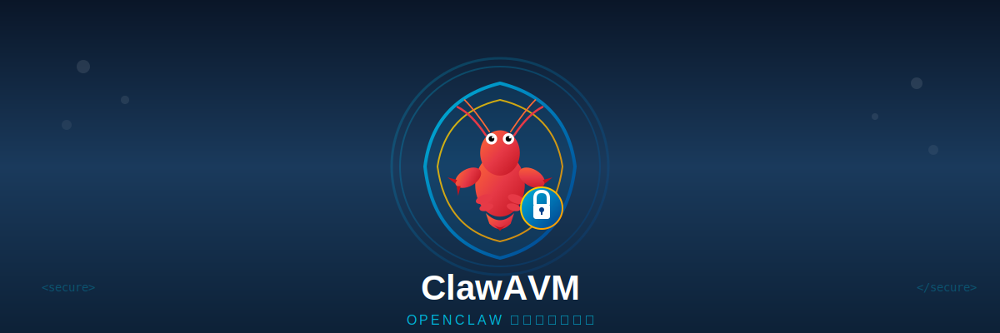

<p align="center">
  
</p>

> 🛡️ **无风险安装 OpenClaw 必备神器** —— 让你的电脑环境与 OpenClaw 风险完全隔离

<p align="center">
  <a href="https://python.org"></a>
  <a href="LICENSE"></a>
  
  
</p>

---

## 🎯 为什么需要 ClawAVM？

你是一个 **OpenClaw 用户**，想要：
- 🤖 让 AI 在隔离环境中安全运行，**不污染你的主系统**
- 🔬 测试各种软件配置，**搞坏了随时可以重置**
- 🔒 处理敏感文件，**确保病毒/木马无法逃逸到主机**
- ⚡ 一键创建干净环境，**用完即弃，不留痕迹**

**ClawAVM 是你的终极解决方案。**

---

## 🦞 核心卖点

### 🛡️ 与 OpenClaw 完全隔离
```
┌─────────────────────────────────────────────────────────┐
│  💻 你的主电脑（绝对安全）                                │
│  ┌───────────────────────────────────────────────────┐  │
│  │  🔒 ClawAVM 安全隔离虚拟机                         │  │
│  │  ┌─────────────────────────────────────────────┐  │  │
│  │  │  🤖 OpenClaw / 任何软件                      │  │  │
│  │  │  • 网络完全隔离 ❌                           │  │  │
│  │  │  • 剪贴板禁用 ❌                             │  │  │
│  │  │  • 文件无法拖入拖出 ❌                        │  │  │
│  │  │  • USB 禁用 ❌                              │  │  │
│  │  └─────────────────────────────────────────────┘  │  │
│  └───────────────────────────────────────────────────┘  │
└─────────────────────────────────────────────────────────┘
```

### ⚡ 一键隔离，零配置
| 安全功能 | ClawAVM | 传统虚拟机 |
|---------|---------|-----------|
| 网络隔离 | ✅ **默认开启** | ❌ 需手动配置 |
| 剪贴板隔离 | ✅ **默认禁用** | ❌ 通常开启 |
| 拖放禁用 | ✅ **默认禁用** | ❌ 通常开启 |
| USB 禁用 | ✅ **默认禁用** | ❌ 需手动配置 |
| 快照恢复 | ✅ **一键回滚** | ⚠️ 操作复杂 |

### 🖥️ 三平台全覆盖
- **Windows** → VMware Workstation / VirtualBox
- **macOS** → VMware Fusion / VirtualBox  
- **Linux** → VMware Workstation / VirtualBox

---

## 🚀 30 秒上手指南

### 1️⃣ 安装
```bash
git clone https://github.com/datappt8/clawavm.git
cd clawavm
pip install -r requirements.txt
```

### 2️⃣ 创建隔离虚拟机
```python
from claw_avm import ClawSecureVirtualBoxEngine
from claw_avm.secure.engine import VMConfig

# 初始化引擎
engine = ClawSecureVirtualBoxEngine(workspace_path="./clawavm_isolated")

# 创建完全隔离的虚拟机
config = VMConfig(
    name="OpenClawSafeZone",
    memory_mb=4096,
    cpu_cores=2,
    disk_gb=50,
    network_isolated=True,   # 🔒 网络隔离
    clipboard_shared=False,  # 🔒 禁用剪贴板
    drag_drop_enabled=False  # 🔒 禁用拖放
)

vm_id = engine.create_secure_vm(config)
print(f"✅ 隔离虚拟机已创建: {vm_id}")

# 启动
engine.start_vm(vm_id)
```

### 3️⃣ macOS 用户选择 VMware Fusion
```python
from claw_avm import ClawSecureVMwareFusionEngine

# macOS 上使用 VMware Fusion（性能更佳）
engine = ClawSecureVMwareFusionEngine(workspace_path="./clawavm_isolated")
vm_id = engine.create_secure_vm(config)
engine.start_vm(vm_id)
```

### 4️⃣ 图形界面版本
```bash
python -m claw_avm.gui
```

---

## 🎬 真实使用场景

### 场景 1：安全运行 OpenClaw
```python
# 创建一个干净的虚拟机，专门运行 OpenClaw
vm = engine.create_secure_vm(config)
engine.start_vm(vm)

# 在里面安装 OpenClaw，尽情使用...
# 即使中病毒，也只能感染虚拟机

# 用完后恢复干净状态
engine.restore_snapshot(vm, "CleanState")
```

### 场景 2：测试危险软件
```python
# 下载了来路不明的软件？先在虚拟机里跑
engine.start_vm(vm)
# 测试软件...
# 有问题？直接删除虚拟机，主机零风险
```

### 场景 3：软件兼容性测试
```python
# 测试新版本是否稳定
engine.create_security_snapshot(vm, "BeforeTest")
# 安装测试...
# 搞坏了？一键回滚
engine.restore_snapshot(vm, "BeforeTest")
```

---

## 🔧 支持的虚拟化平台

| 平台 | Windows | macOS | Linux | 说明 |
|------|---------|-------|-------|------|
| VMware Workstation | ✅ | ❌ | ✅ | 企业级性能 |
| VMware Fusion | ❌ | ✅ | ❌ | Mac 专用 |
| VirtualBox | ✅ | ✅ | ✅ | **免费首选** |

---

## 🌍 多语言支持

🇨🇳 简体中文 | 🇺🇸 English | 🇯🇵 日本語 | 🇰🇷 한국어 | 🇩🇪 Deutsch | 🇫🇷 Français | 🇪🇸 Español | 🇷🇺 Русский | 🇮🇹 Italiano | 🇧🇷 Português | 🇹🇷 Türkçe | 🇵🇱 Polski | 🇳🇱 Nederlands | 🇸🇪 Svenska | 🇻🇳 Tiếng Việt

---

## 🤝 参与贡献

欢迎提交 Issue 和 PR！

1. Fork 本仓库
2. 创建分支 `git checkout -b feature/AmazingFeature`
3. 提交更改 `git commit -m 'Add some AmazingFeature'`
4. 推送分支 `git push origin feature/AmazingFeature`
5. 创建 Pull Request

---

## 📄 许可证

MIT License - 详见 [LICENSE](LICENSE) 文件

---

<div align="center">

**🦞 OpenClaw 安全隔离，一键可达**

</div>
